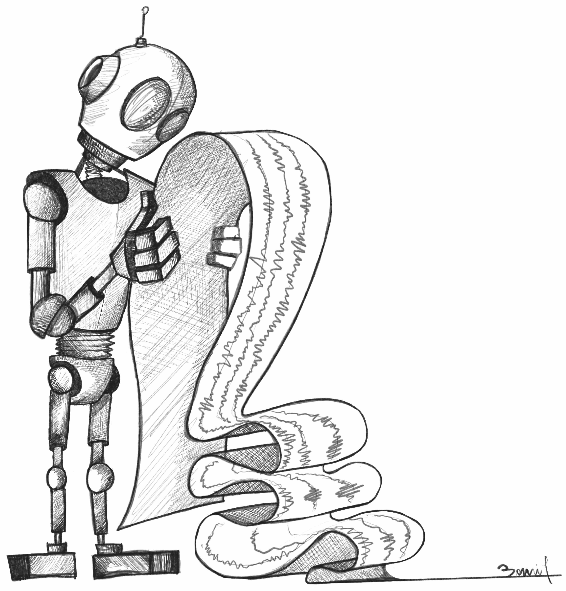

<p align="center">

</p>


<h1 align="center">TSADtaxonomy</h1>
<h2 align="center"> Time Series Anomaly Detection Taxonomy</h2>


## TSADtaxonomy in short
This application helps users explore and understand the vast array of existing methods, ranging from traditional statistical approaches to modern machine learning algorithms. It visualizes a structured, process-centric taxonomy of anomaly detection techniques, enabling a deeper insight into the research landscape.

## 🔍 Features
- Navigate a process-centric taxonomy of anomaly detection techniques
- Get an overview and characteristics of a large variety of methods for time series anomaly detection
- Get the BibTeX source, links to the paper, and code for each method.

## 🌐 Try it Online

Explore our taxonomy: 👉 [**TSADtaxonomy**]()

## A method is missing?

We welcome contributions of new anomaly detection methods to enrich the taxonomy featured in this project. If you have a method you find interesting and would like to add it, please submit a JSON file describing the method using the format below.

The JSON should include key details about the method, such as its name, category, supervision type, and references to the original paper and code.

```json
{
  "name": "method name",
  "full_name": "A longer name",
  "category": "second-level-in-the-taxonomy",
  "Dim": "Uni/Multivariate",
  "Sup": "Un/Semi-supervised",
  "Stream": true/false,
  "year": 2025,
  "authors": ["author1","author2"],
  "paper": "the title of the paper. The venue or journal. A volume number, an issue number, etc",
  "description": "A short description of what the method does.",
  "code": "link/to/the/code",
  "url": "link/to/the/paper",
  "bibtex": "@article{bibtex reference}"
}
```

### How to Submit

Please open a pull request in our repository, attaching the JSON file. Ensure your submission follows the exact format to facilitate smooth integration.

#### Guidelines

- Provide accurate and complete metadata for your method.
- Ensure URLs are valid and accessible.
- Include a clear and concise description.
- Follow JSON syntax carefully.

Thank you for contributing to improving this taxonomy and the interactive navigation experience! We alone would struggle to keep track of all the publications on time series anomaly detection.

## Contributors

- Paul Boniol
- John Paparrizos
- Qinghua Liu
- Mingyi Huang
- Themis Palpanas
- Yash Krishnani
